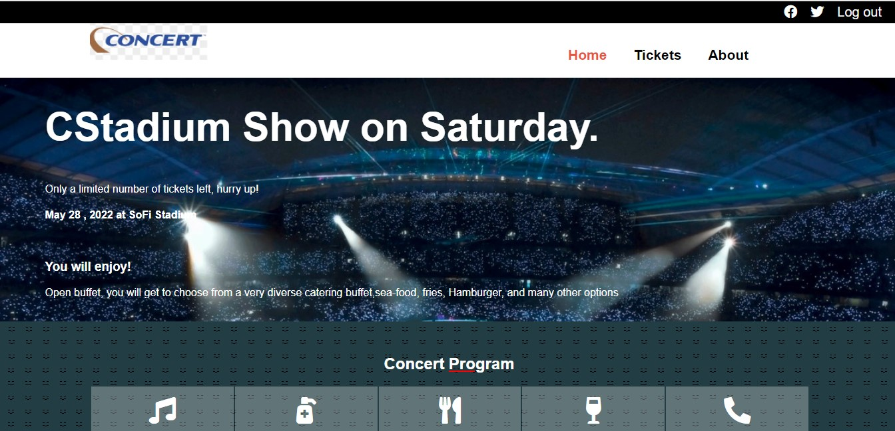
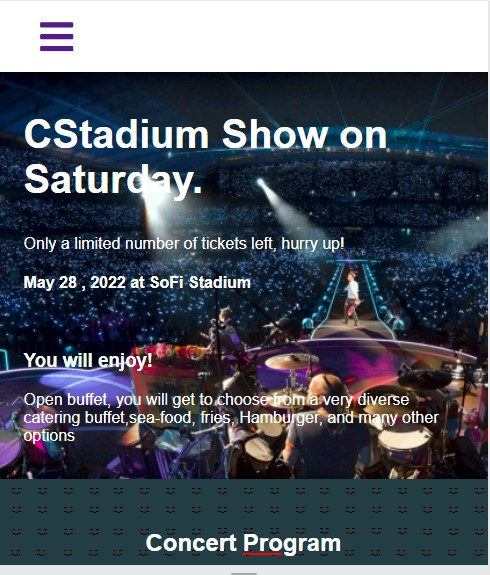

# Concert Website Project
Concert website is a site for a conceptual concert event, it is a solo project accomplished to satisfy Microverse capstone requirement. I would like through this work to demonstrate mastery in HTML, CSS in addition to skills in other important aspects like good UI design.. 
This roject is based on an online website for a conference, more details below under Credits paragraph

# Screenshot

# Live Demo

[Live Demo Link]https://nati2323.github.io/Concert/

# Video Presentation
[Presentation]

# Built With
* CSS
* HTML
* JavaScript

# Authors

## Natnael Amare
* Github:https://github.com/nati2323/Concert/tree/First_Capstone
* LinkedIn:https://www.linkedin.com/in/natnael-amare-b5844510a/

## Credits
The original design can be seen at ('https://www.behance.net/gallery/29845175/CC-Global-Summit-2015')
Special thanks to Cindy Shin the owner of the project

## Contributing
Contributions, issues and feature requests are welcome!
